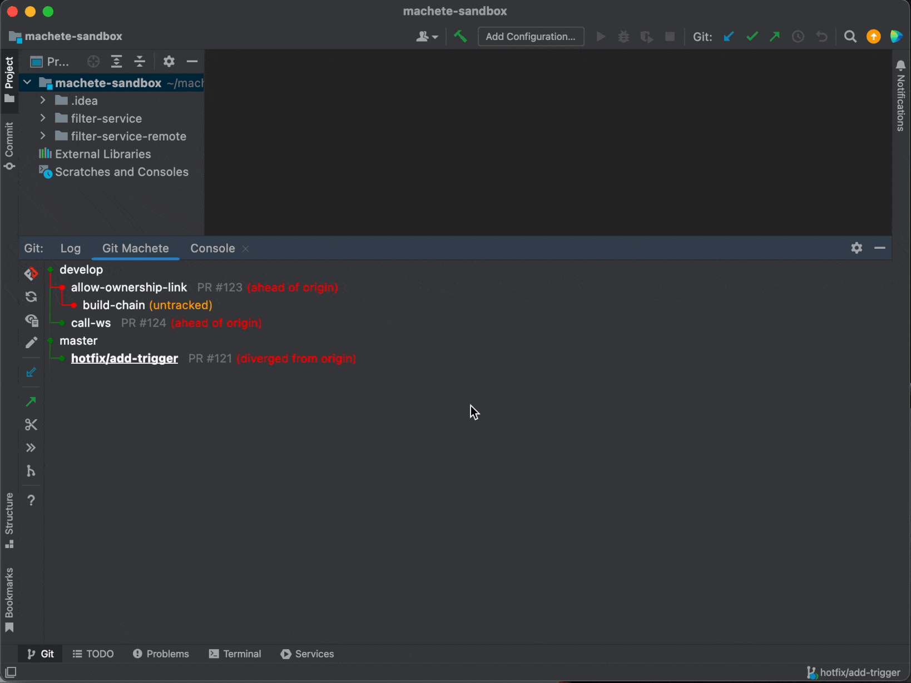
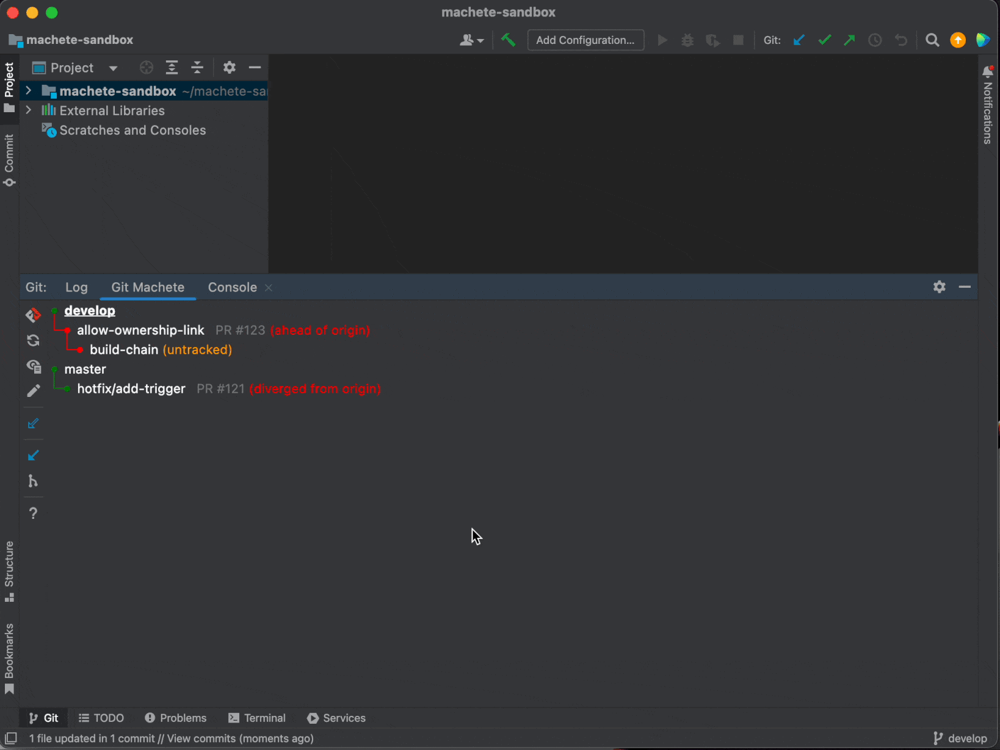
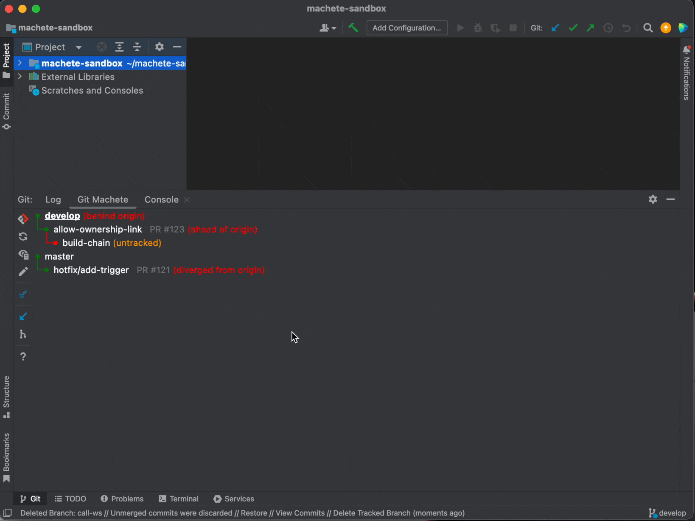
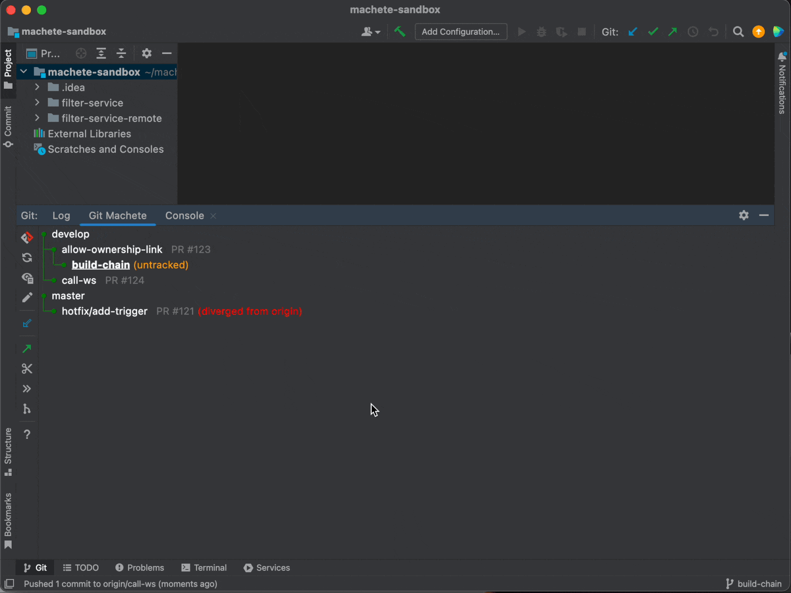
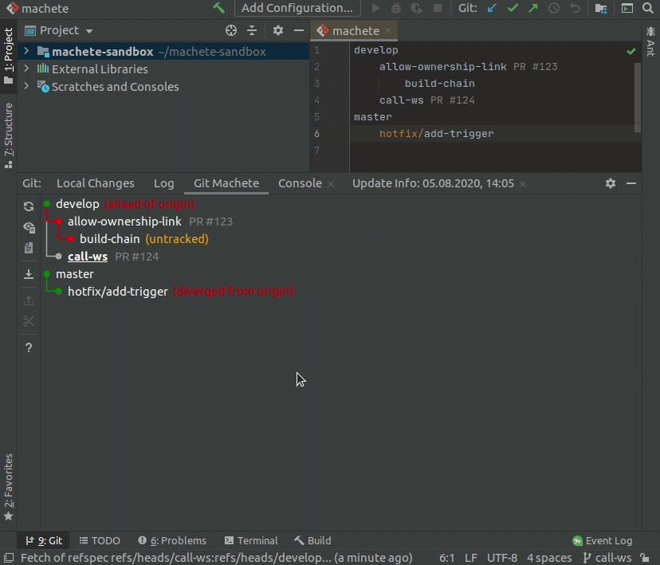
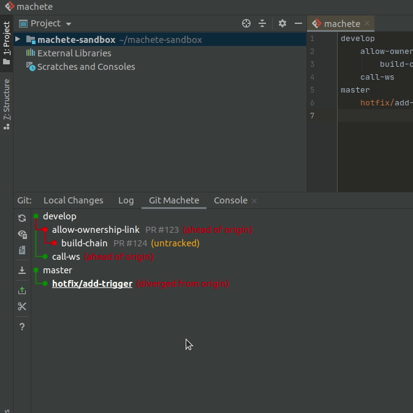

# Git Machete IntelliJ Plugin

[](https://circleci.com/gh/VirtusLab/git-machete-intellij-plugin/tree/master)
[](https://plugins.jetbrains.com/plugin/14221-git-machete)
[](https://plugins.jetbrains.com/plugin/14221-git-machete)


Git Machete plugin is a robust tool that simplify your git related workflow.
It's a great completion of IntelliJ version control system.
You can with ease rebase branches, do pull, push or reset.
Just define what you would like your branch tree to look like and leave the rest to Git Machete.
It gives you simple view of what's going on in your repository.
Just look at the edge colors or status descriptions to see what should be rebased, pushed, pulled or reset.

With this plugin you can simply maintain small pull request that are easy to review.

This is a port of [git-machete](https://github.com/VirtusLab/git-machete#git-machete) into an IntelliJ plugin.

This plugin is available on [JetBrains Marketplace](https://plugins.jetbrains.com/plugin/14221-git-machete).

**It is compatible with all JetBrains products except Android Studio.
Minimum required version is 2020.1**.


## Installing

### Install from JetBrains Marketplace

This plugin is available on [JetBrains Marketplace](https://plugins.jetbrains.com/plugin/14221-git-machete). <br/>
To install this plugin go to `File` -> `Settings` -> `Plugins`, then make sure you are on `Marketplace` tab (not `Installed`), in search box type `Git Machete` and click `Install`.
Plugin will be installed. After installation depending on IDE version restart may be required. In that case just click `Restart IDE` and confirm that action in a messagebox.


## How it works

Git Machete IntelliJ Plugin is a port of a great console tool - [git-machete](https://github.com/VirtusLab/git-machete#git-machete), into an IntelliJ plugin.
Git Machete can help you manage your repository branches and keep it in sync with each other and its counterparts on a remote repository.
Let's see how this plugin can help you:

### Where to find the plugin tab

Git Machete IntelliJ Plugin is available under `Git` (`VCS` in older IntelliJ versions) tool window in the `Git Machete` tab.
You can also use `Ctrl` + `Alt` + `Shift` + `M` shortcut to open it.


### Machete file edition

`machete` file describes relation between branches in your repository (these relations are probably determined by order of branch creation - which branch form which - but this is not a rule).
It's located inside `.git` directory in your repo.
This is the example of `machete` file:
```
develop
    allow-ownership-link PR #123
        build-chain PR #124
    call-ws
master
    hotfix/add-trigger
```
`develop`, `allow-ownership-link`, `build-chain`, `call-ws`, `master` and `hotfix/add-trigger` are branch names.
Two of them (`allow-ownership-link` and `build-chain`) have custom annotation - it's some kind of short description for given branch and it can be any text that will be displayed next to this branch - in this case they are pull request numbers.
Relation between these branches is determined by indentations - here single indent is 4 spaces but also tabulation(s) can be used.
In the example above branches `allow-ownership-link` and `call-ws` are children of `develop` and `build-chain` is a child of `allow-ownership-link`.
The same for `hotfix/add-trigger` and `master` - former is a child of latter.
`develop` and `master` are root branches.

When branch tree is created, Git Machete indicates relation between parent branch and each of its child branches.
If edge between them is green that means child branch is in sync with its parent branch - in other words there are no commits in parent branch that don't belong to the child.
But if there are some of that commits, then edge is red - we need to [rebase](#rebase) child branch onto the parent.

Machete file editor will help you to manage `machete` file: it underlines any errors (bad indentation or nonexistent branches) and propose branch names based on local repository branches.
When file editing is done, you can click button in top right corner of file editor to refresh machete branch tree.


For more information about `machete` file look at the [reference blog post](https://medium.com/virtuslab/make-your-way-through-the-git-rebase-jungle-with-git-machete-e2ed4dbacd02)

### Checking out branches

With Git Machete you can easily check out branches that have been defined in `machete` file.
Just right-click on the branch you wont to check out and select `Checkout Branch`.
You can also double-click on the selected branch to check it out.
Current branch is underlined in branch tree.



### Listing commits

Git Machete can display commits belonging to the branches.
It displays only these commits that are unique for the selected branch (i.e. were never a tip of a different branch).
When you click on eye button on the left side of plugin, you can toggle between show and hide commits.


### Rebase

Rebase with Git Machete plugin is easy!
Just right-click on the child branch and from context menu select `(Checkout and) Rebase Branch onto Parent` and a standard IntelliJ dialog for interactive rebase will appear.


### Push

After a rebase, you might want to push rebased branch to remote.
To do this, right-click on the branch you want to push and select `Push (Current) Branch` from context menu.
Push dialog will appear with proper push button (regular push or force push) depending on which of them is needed.
Basically, we need force push in case when we rebased our branch, because in this case parent of the first commit that we want to push (that is one of `new base` commits)
is not the last commit of pushed branch in a remote repository, so git won't let us do regular push.



### Pull

If branch is behind (or in sync with) its remote, it can be pulled.
To do this, right-click on given branch and select `Pull Branch`.
This action does `--ff-only` pull only which is enough in this case.



### Reset to remote

If given branch is not in sync with its remote, we can reset it to point to the exact same commit as the remote.
From right-click context menu select `Checkout and Reset Branch to Remote`.
This action performs `git reset --keep` under the hood. `--keep`, as opposed to `--hard`, keeps your uncommitted changes safe from getting overwritten.


### Fast forward parent

When you are done with the changes on the selected branch (e.g. PR was approved and all required fixes are applied), you probably want to merge this branch to its parent branch.
When these branches are in sync (green edge) you can do a fast-forward merge.
Fast forward merge is nothing else like move tip of branch to which we merge to the same commit as tip of merged branch.
This is what `Fast Forward Parent Branch To Match Current Branch` context menu action do.
As you can see, edge between given branch and its parent was changed to grey - it means that the child branch has been merged.



### Slide out branch

When branch was merged (and sometimes in other cases as well), you probably want to remove this branch from branch tree.
To do this with easy (and without manual editing of `machete` file) you can use `Slide Out Selected Branch` action.
This action will modify branch tree for you - delete the selected branch and reattach its children as children of deleted branch parent.
When the `machete.slideOut.deleteLocalBranch` git configuration key is set to `true`, then this action delete also sided out branch from your git repository.
The easiest way to set this key is using `git config --add machete.slideOut.deleteLocalBranch true` command inside given repository.
If you want to set this key globally (to by used for all repositories that don't have this key set explicitly), add `--global` option to the previous command.





### Slide in branch

You can also create new branch bellow selected one (also without manual editing `machete` file). To do this, choose `Slide In Branch Bellow Selected Branch` action from context menu.
Dialog window will appear.
In text box type new branch name and click `Slide In` button.
Another dialog will appear - it is a standard new branch IntelliJ dialog.


This action can also be used to reattach an existing branch below a selected one.
In this case you just must type name of existing branch that you want to reattach and then click `Slide In`.
You can also select `Reattach children` checkbox to move along all children of the reattached branch.


### Other actions

On the left side bar you can find other actions (from top to bottom):
-  **Refresh Status** - refreshing (reload) branch tree (the graph displayed in main plugin window)
-  **Toggle Listing Commits** - show or hide commits belonging to branches (for more details see section [Listing commits](#listing-commits))
-  **Open Machete File** - open `machete` file in IntelliJ editor (to see what this editor can do see [Machete file editor](#machete-file-editor) section)
-  **Fetch All Remotes** - equivalent of `git fetch --all` command
-  **Push Current Branch** - push branch that is currently checked out (shortcut of [Push](#push) context menu action for the current branch)
-  **Rebase Current Branch Onto Parent** - rebase currently checked out branch onto its parent (shortcut of [Rebase](#rebase) context menu action for the current branch)
-  **Show Help Window** - show window with example branch tree and explanation what parts of this graph mean

### Multi-repository support

Git Machete support many git repositories in one project. It can be many standard repositories or submodules.
If more than one repository will be detected, then selection list will appear in top of main plugin window.
In that case each repository will have its own `machete` file.


## Build

### Prerequisites

* git
* latest 2020.1 Community Edition/Ultimate

  * Install [Lombok plugin](https://plugins.jetbrains.com/plugin/6317-lombok/)
  * Enable annotation processing (for Lombok):
    `File` -> `Settings` -> `Build`, `Execution`, `Deployment` -> `Compiler` -> `Annotation Processors` -> `Enable Annotation Processing`
  * Set Project SDK to JDK 11: `Project Structure` -> `Project`

Consider increasing maximum heap size for the IDE (the default value is 2048 MB) under `Help` -> `Change Memory Settings`.

For running `./gradlew` from command line, make sure that `java` and `javac` are in `PATH` and point to Java 11.

### Building

To build the project, run `./gradlew build`.

Currently, very generous maximum heap size options are applied for Gradle's Java compilation tasks (search for `-Xmx` in [build.gradle](build.gradle)). <br/>
To overwrite them, use `compileJavaJvmArgs` Gradle project property
(e.g. `./gradlew -PcompileJavaJvmArgs='-Xmx2g -XX:+HeapDumpOnOutOfMemoryError' build`,
or equivalently with an env var: `ORG_GRADLE_PROJECT_compileJavaJvmArgs='-Xmx2g -XX:+HeapDumpOnOutOfMemoryError' ./gradlew compileJava`).

By default, Lombok's annotation processor runs on the fly and Delomboked sources are not saved to {subproject}/build/delombok/...<br/>
To enable Delombok, set `useDelombok` Gradle project property (e.g. `./gradlew -PuseDelombok build`).

In case of spurious cache-related issues with Gradle build, try one of the following:
* `./gradlew --stop` to shut down gradle daemon
* `./gradlew clean` and re-run the failing `./gradlew` command with `--no-build-cache`
* remove .gradle/ directory in the project directory
* remove ~/.gradle/caches/ (or even the entire ~/.gradle/) directory


### Generate plugin zip

To generate a plugin archive run `:buildPlugin` Gradle task (`Gradle panel` -> `Tasks` -> `intellij` -> `buildPlugin` or `./gradlew buildPlugin`).<br/>
The resulting file will be available under `build/distributions/`.


## Issue reporting

If you see any bug or just would like to propose any new feature, feel free to create an issue.
When you report a bug please include logs from IntelliJ.<br/>
It can be very helpful for us to enable logging on debug level and then reproduce bug.
To do this, go to `Help` -> `Diagnostic Tools` -> `Debug Log Settings` and then paste the following lines:

```
binding
branchlayout
gitcore
gitmachete.backend
gitmachete.frontend.actions
gitmachete.frontend.externalsystem
gitmachete.frontend.graph
gitmachete.frontend.ui
```

Then reproduce the bug and go to `Help` -> `Show Log in Files` to open the log file.

## Development

For more details on development of the project, see the [guideline](DEVELOPMENT.md).
